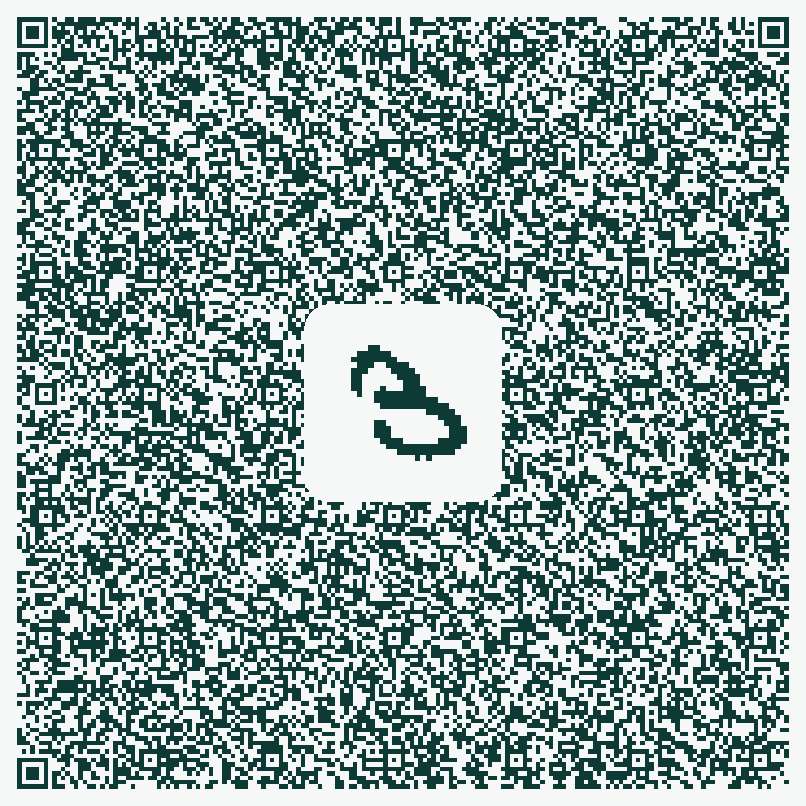

# MNIST in a QR code

A handwritten-digit classifier inside one QR code. Scan it, draw a digit, it answers.



**[Try it](https://123satyajeet123.github.io/mnist-qr/demo.html)**

96.37% on the MNIST test set · 627 B of weights, one bit each · 2,948 of 2,953 bytes

## How

```
https://123satyajeet123.github.io/mnist-qr/#H4sIAAAAAAAC_41Xa…
└───────────────── 44 B ─────────────────┘└────── 2,904 B ──────┘
                                    gzip(markup + classifier + weights)
```

Fragments are never sent to a server. The page inflates one and runs it.

Chrome blocks top-frame `data:` URIs, so a version with no page at all would be
Safari only.

## Network

```
28×28 ──conv 5×5 ×24──> 24×24 ──ReLU──> ──maxpool 6×6──> 4×4 ──dense──> 10
           600 bits                                          3,840 bits
```

627 B = 4,440 one-bit weights + 72 B of per-channel scales, shifts and biases.

The dense layer costs `grid² × filters × 10` bits, so pooling harder buys filters.

## Build

```
train.py ─> model.npz ─> build.py ─┬─> mnist_qr.png       the code
                                   ├─> docs/index.html    the page it opens
                                   └─> testset.json       what verify.mjs checks
```

`infer.js` is spliced into the payload, the page and the test, so they cannot drift.

```sh
python3 -m venv --system-site-packages .venv && .venv/bin/pip install segno
npm install

.venv/bin/python train.py mnist_data 24 6 model.npz   # downloads MNIST, ~15 min
.venv/bin/python build.py model.npz
node verify.mjs                                       # JS must match numpy
```

## Files

| | |
|---|---|
| `train.py` | binary-weight CNN, explicit gradients, numpy only |
| `page.src.html` | what the QR carries, before terser |
| `viewer.src.html` | the page it lands on |
| `build.py` | packs the bits, assembles both pages, emits the QR |
