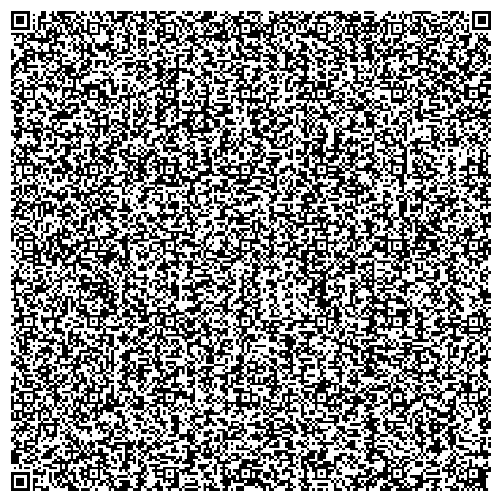

# MNIST in a QR code

A handwritten-digit classifier — the weights, the inference code and its
interface — that fits inside **one QR code**. Scan it, draw a digit, it tells
you what you drew. Nothing is fetched. No model is stored on any server.



**[Open it without a camera →](https://123satyajeet123.github.io/mnist-qr/demo.html)**

| | |
|---|---|
| Accuracy, full 10,000-image test set | **96.37%** |
| Model weights | **627 bytes**, one bit each |
| QR payload | **2,948 / 2,953 bytes** (v40-L byte mode) |
| Architecture | 5×5 conv ×24 → BatchNorm → ReLU → 4×4 max-pool → dense-10 |

The 2,953-byte ceiling is the QR specification, not a design target, and it
picked the architecture: the dense layer costs `grid² × filters × 10` bits, so
pooling harder is what buys filters.

## How it works

The QR contains a single URL. Everything after the `#` is the program:

```
https://123satyajeet123.github.io/mnist-qr/#H4sIAAAAAAAC_41Xa…
└──────────────── 44 bytes ─────────────────┘└─ 2,904 bytes ─┘
```

- **The fragment is never sent to the server.** That is the HTTP specification,
  not a convention — so the model travels in the code you scanned and nowhere else.
- It is `base64url(gzip(entire page))`: markup, CSS, the classifier, and the
  627 bytes of weights.
- The page it lands on inflates that with `DecompressionStream` and runs it in
  an iframe. The page holds no model of its own.

Inference runs on your device, in JavaScript, offline once loaded.

Chrome blocks top-frame `data:` URI navigation outright — including URIs typed
into the omnibox — so a payload with no host at all would be Safari-only. The
fragment carries the same bytes and works in every browser.

## The viewer

The landing page is served, so it costs the QR nothing. It reads the *same*
bytes and shows what arrived:

- the 24 convolution kernels, drawn from the actual bits — white is +1, dark is −1
- the ten per-digit scores for whatever you just drew
- the 28×28 the network is actually given, next to your 280×280 drawing
- where the 2,948 bytes went

It never reimplements the network: `build.py` splices the same `infer.js` into
both the payload and the viewer, so they cannot drift.

## Verified, not asserted

```
js/numpy agreement   300/300        same packed bytes, node vs numpy
QR decode            zbar, 480p-2400p, every size tested
full test set        96.37%         n=10,000, scored from the decoded payload
end-to-end           draw → 28×28 → scores → prediction, in Chrome
```

## Build

```sh
python3 -m venv --system-site-packages .venv && .venv/bin/pip install segno
npm install terser

.venv/bin/python train.py mnist_data 24 6 model.npz   # downloads MNIST, ~15 min
.venv/bin/python build.py model.npz                   # packs, writes docs/ and the QR
node verify.mjs                                       # gate: JS must match numpy
```

## Files

| | |
|---|---|
| `train.py` | binary-weight CNN, explicit gradients, numpy only, no autograd |
| `infer.js` | unpack + score. Spliced into the payload *and* the viewer *and* loaded by `verify.mjs` |
| `page.src.html` | the payload: what the QR carries. Readable; terser minifies it at build time |
| `viewer.src.html` | the hosted page around it |
| `build.py` | packs weights to bits, assembles both pages, emits the QR, mirrors `infer.js` in numpy as a cross-check |
| `verify.mjs` | the gate |

## Two decisions the byte budget forced

- **Centring moved from inference to training.** Normalising the digit at
  inference cost 261 gzipped bytes on every scan, forever. Random-shift
  augmentation during training buys the same robustness for zero payload bytes.
- **Convolution replaced the dense first layer.** 95.4% → 97.3% while using
  *fewer* bits. A dense layer was burning 12,544 of 13,184 weights on one matrix.
