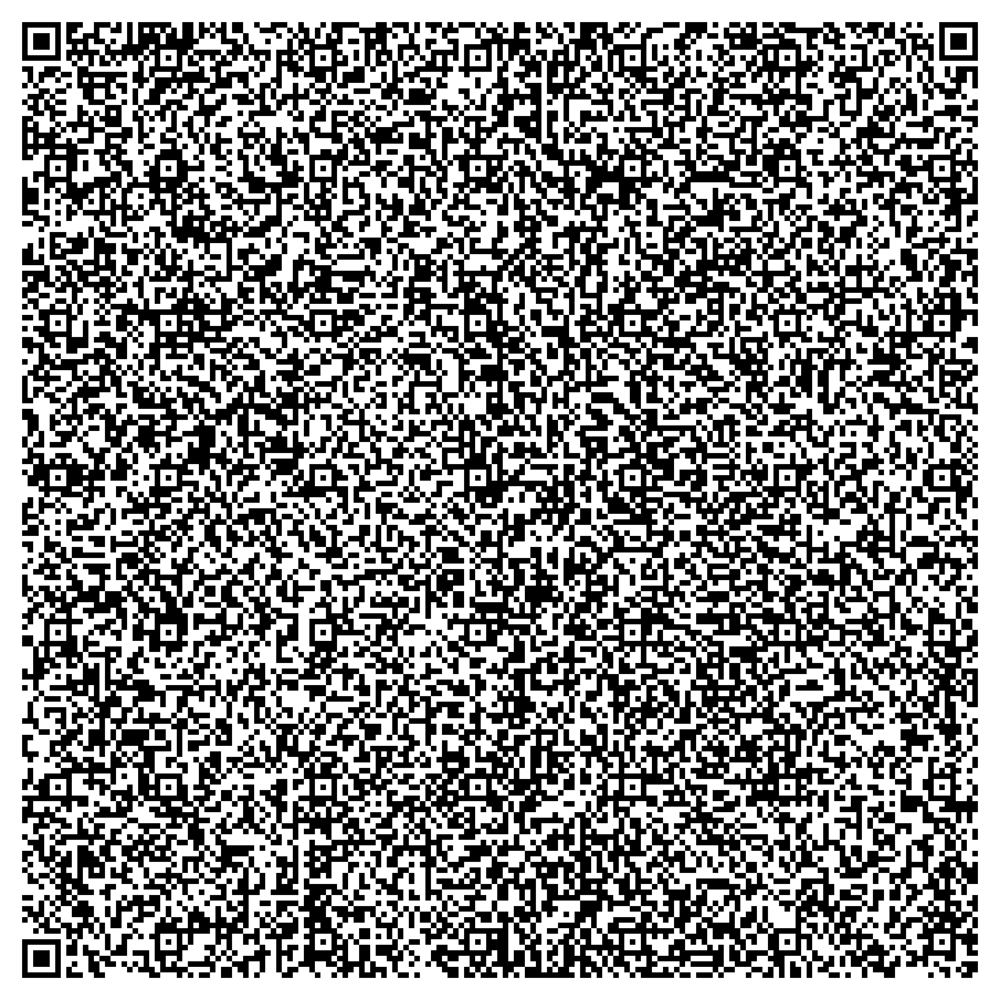

# MNIST in a QR code

A handwritten-digit classifier — weights, inference and drawing UI — that fits
entirely inside **one QR code**. Scan it and a working neural net opens in your
browser. Nothing is fetched, nothing is hosted, there is no server.



**[Open it without a camera →](https://123satyajeet123.github.io/mnist-qr/demo.html)**

## Numbers

| | |
|---|---|
| Test accuracy (full 10,000 images) | **96.37%** |
| Model weights | **627 bytes** |
| Total QR payload | **2,911 / 2,953 bytes** (QR v40-L byte mode, 42 spare) |
| Architecture | 5×5 conv, 24 filters → BatchNorm+ReLU → 6×6 maxpool → FC-10 |
| Weight precision | **1 bit** (±1). Per-channel scale/shift are int8. |

The 2,953-byte ceiling is the QR spec, not a design choice, and it picked the
architecture: the fully-connected layer costs `grid² × filters × 10` bits, so
pooling harder is what buys filters.

## Verified, not asserted

```
js/numpy agreement   300/300          verify.mjs, same packed bytes
QR PNG decode        EXACT MATCH      2,911/2,911 bytes recovered from the image
full test set        96.37%           n=10,000, scored from the decoded payload
Safari end-to-end    11/12 digits     data: URI -> gunzip -> unpack -> predict
```

## Reproduce

```sh
python3 -m venv --system-site-packages .venv && .venv/bin/pip install segno
.venv/bin/python train.py mnist_data 24 6 model.npz   # downloads MNIST, ~15 min
.venv/bin/python build.py model.npz                   # packs + writes mnist_qr.png
node verify.mjs                                       # gate: JS must match numpy
```

## Two builds, because Chrome closed the obvious door

Chrome blocks **all** top-frame navigations to `data:` URLs — including ones you
type into the omnibox. Safari allows them. So a genuinely self-contained payload
is Safari-only, and that is a deliberate browser decision, not a bug in the
payload.

The fix is to carry the same bytes in a **URL fragment**. Fragments are never
sent to the server, so the model still travels entirely inside the QR code; the
page it lands on is a 1 KB static stub that inflates what the scanner already
carried. It never sees, stores or transmits anything.

| build | payload | QR | works in |
|---|---|---|---|
| `mnist_qr.png` — self-contained `data:` URI | 2,911 B | v40, 177 modules | Safari only |
| **`mnist_qr_universal.png` — fragment** | **2,792 B** | **v39, 161 modules** | **every browser** |

The universal one is *smaller*, because dropping the inline loader freed 119
bytes — enough to drop a whole QR version. Fewer modules also means it scans
from further away.

Verified in headless Chrome: the fragment decodes, inflates and renders the
classifier, canvas and all.

## The other real limitation

**It needs a ≥1080p capture.** 177 modules square needs roughly two camera pixels
per module. Measured: 1080p and 1440p decode, 720p and 480p fail. Scan the
full-resolution image, not a timeline thumbnail.

## How it is delivered

The QR holds a `data:text/html` URI containing a ~160-byte loader. That loader
`fetch`es a base64 gzip stream, inflates it with `DecompressionStream('gzip')`,
and `document.write`s the result. Budget after the outer base64's 4/3 expansion:

```
QR ceiling              2,953 B
  loader shell            164 B
  gzip(page) x 4/3      2,747 B   ->  page must gzip to 2,091 B
      code                1,339 B
      weights               627 B
```

Two decisions came out of measuring that table rather than guessing:

- **Centring moved from inference to training.** Normalising the digit at
  inference cost 261 gzipped bytes on every scan forever. Random-shift
  augmentation during training buys the same robustness for zero payload bytes.
- **`drawImage` replaced the downsample loop.** MNIST normalises each digit into
  a 20×20 box centred in 28×28; the browser's own resampler does that in one
  call, so the UI does no pixel arithmetic of its own.

## Files

| | |
|---|---|
| `train.py` | binary-weight CNN, explicit gradients, numpy only, no autograd |
| `infer.js` | unpack + predict. Inlined into the payload *and* loaded by `verify.mjs`, so the demo and its test cannot drift |
| `build.py` | packs weights to bits, builds the page, emits the QR, mirrors `infer.js` in numpy as a cross-check |
| `verify.mjs` | the gate |
